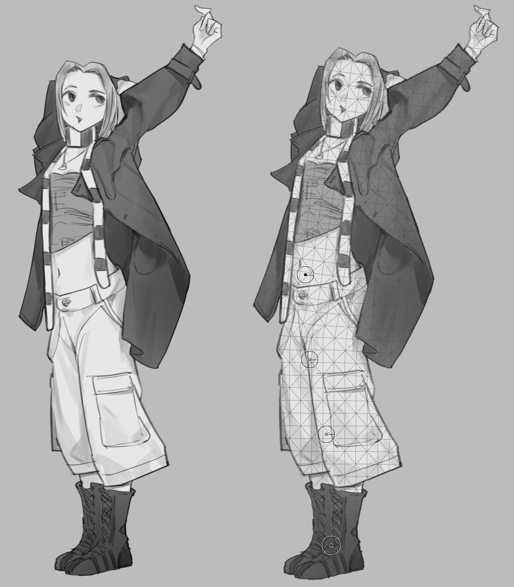

## Solstice

Solstice is an unofficial, desktop-focused custom build based on the Krita 6 development branch.
It preserves Krita's painting workflow while integrating project-specific interface and productivity changes.

## Table of Contents

- [Main differences from upstream Krita](#main-differences-from-upstream-krita)
- [Ported Plugin](#ported-plugin)
  - [Quick Access Manager](#quick-access-manager)
  - [Rest Note](#rest-note)
  - [Asset Library](#asset-library)
  - [Vision ML](#vision-ml)
- [New Features](#new-features)
  - [Puppet Warp](#puppet-warp)
- [Branches](#branches)
- [Building](#building)

## Main differences from upstream Krita

- Solstice is desktop-only. Krita's Android application, Android build and packaging rules, donation integration, and related platform-specific code have been removed.
- Selected third-party Python plugins have been migrated into native C++ Krita plugins. They participate in Krita's normal plugin lifecycle and no longer depend on Python, PyQt, or private Python-side tool injection.
- The welcome page includes an **Asset Library** tab alongside **Recent Images**. It shares the native Asset Library configuration and features without embedding the docker itself.
- The Transform Tool includes a native **Puppet Warp** mode with movable and rotatable pins, artwork-aware mesh visualization, configurable expansion, and serialized transform state.
- Native AI-assisted selection, background removal, and smart fill are available through Vision ML, with CPU fallback and optional Vulkan GPU acceleration.
- Quick-access, color-selection, brush-adjustment, timer, and asset-management workflows are integrated as maintained native features of this custom build.

## Ported Plugin

The following external Python plugins have been reimplemented as native Krita features. The native versions preserve compatibility with their existing user configuration where practical.

### Quick Access Manager

[Quick Access Manager](https://github.com/udtren/krita-quick-access-manager) is now a set of native dockers and popup tools. It provides configurable action, docker, and brush grids; editable profiles; gesture menus; Quick Brush Adjustments; a compact HueSVC selector; and hold-based temporary brush shortcuts. Existing profile aliases, custom labels, colors, icons, and legacy JSON fields remain supported.

Native implementation: [`plugins/dockers/quickaccess`](plugins/dockers/quickaccess/)

### Rest Note

Rest Note is now a native timer docker with working, paused, idle, eye-break, and full-break states. It retains the original plugin's icons and configuration, keeps the small eye-break notification on Krita's current screen, and limits the large break overlay to the Krita window instead of covering the entire monitor.

Native implementation: [`plugins/dockers/restnote`](plugins/dockers/restnote/)

### Asset Library

Asset Library is now a native docker for browsing configured folders, opening assets, and inserting them as paint, vector, or file layers. It preserves the original folder and layout configuration while adding cached, asynchronous thumbnail loading for large libraries. The same configuration and asset operations are also exposed through the independent **Asset Library** tab on Krita's welcome page.

Native implementations: [`plugins/dockers/assetlibrary`](plugins/dockers/assetlibrary/) and [`libs/ui/KisWelcomeAssetLibraryWidget.cpp`](libs/ui/KisWelcomeAssetLibraryWidget.cpp)

### Vision ML

Krita Vision Tools has been migrated from a Python/`ctypes` plugin into native selection tools and filters. It provides point-based and box-based segment selection, Smart Fill, and Background Removal. MobileSAM, MI-GAN, and BiRefNet GGUF models run through the embedded `vision.cpp` runtime, using either the portable CPU backend or Vulkan acceleration on supported GPUs. BiRefNet Dynamic is preferred for background removal when installed, with the bundled BiRefNet Lite model as fallback.

Native implementation and model documentation: [`plugins/visionml`](plugins/visionml/) and [`plugins/visionml/README.md`](plugins/visionml/README.md)

## New Features

### Puppet Warp

Solstice adds a native **Puppet Warp** mode to Krita's Transform Tool for posing characters and reshaping artwork with pins. Puppet Warp generates a mesh that follows the artwork's visible shape, including the interiors of closed line art, and allows the mesh boundary to be expanded when extra working space is needed.

To use it:

1. Select the layer or area to transform, activate the Transform Tool, and choose **Puppet**.
2. Leave **Draw** active and click the artwork to place pins at joints and areas that should remain
   stable.
3. Click **Lock Points** when the pins are ready.
4. Drag a pin's center to move that part of the artwork.
5. Drag the pin's outer ring to rotate the artwork around it.
6. Alt-click a pin center to remove it, then apply or reset the transform normally.

Untouched pins anchor their surrounding regions. Rotation also propagates through an unpinned branch:
for example, rotating a terminal hip pin can turn the upper body while pins below it continue to hold the legs. Placing another pin farther along that branch creates a new boundary and limits the effect.

The **Show mesh** option toggles only the overlay. **Expansion** controls how far the generated mesh extends beyond the detected artwork; at 0 px, the overlay is clipped closely to the artwork rather than extending by whole grid cells.

Implementation notes, current limitations, testing instructions, and the future improvement roadmap are documented in [`docs/puppet-warp.md`](docs/puppet-warp.md).

## Branches

| Branch | Purpose |
| --- | --- |
| `krita-sol` | Custom Krita Sol development and builds |
| `krita/6.0` | Clean tracking branch for synchronizing with upstream Krita 6 |

Custom changes should be made on `krita-sol`. Keep `krita/6.0` aligned with upstream so future
updates can be integrated cleanly.

## Building

Solstice uses Krita's standard desktop build system. Refer to the official
[Building Krita documentation](https://docs.krita.org/en/untranslatable_pages/building_krita.html)
for prerequisites and platform-specific instructions.
