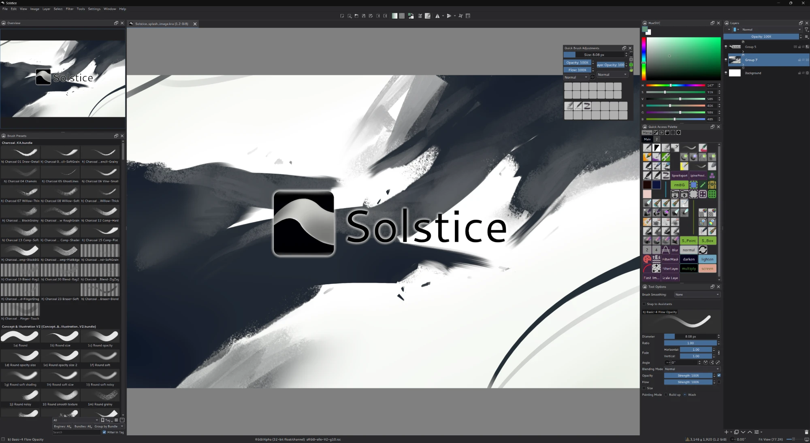
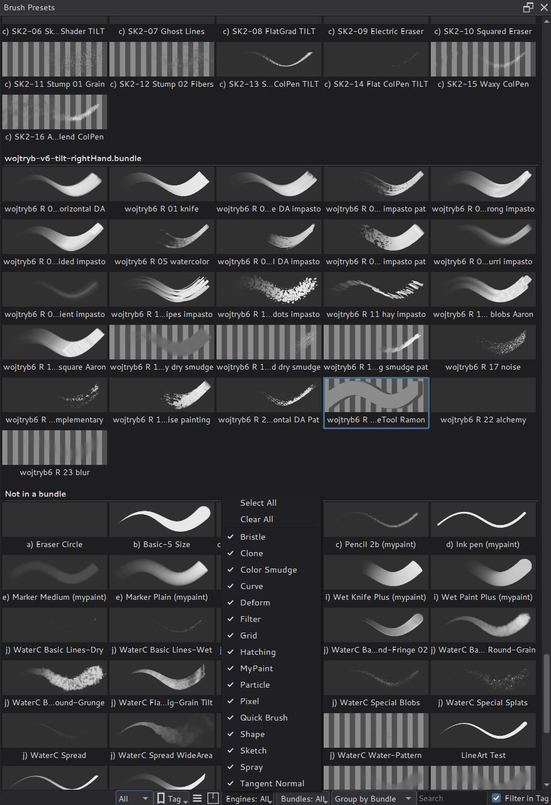

# Solstice

**Solstice is an open-source, GPU-focused digital painting application derived
from the Krita 6 codebase.**

It combines Krita's established painting workflow with Vulkan-powered layer
compositing, an experimental GPU pixel-brush path, and productivity tools
integrated natively into the application.

Solstice is independently maintained and desktop-only. It is not an official
Krita edition, and development no longer tracks upstream Krita. It is in
testing; see [Versions](docs/versioning.md) for the version numbering.

[Highlights](#highlights) | [Development & downloads](#development-and-downloads) | [GPU engine](#gpu-engine) | [Benchmarks](#benchmarks) | [Supported environment](#supported-environment)

## Highlights

- **[Experimental Vulkan engine](docs/gpu-engine.md)**: GPU-resident image
  tiles, accelerated layer compositing and canvas data preparation.
- **[GPU brush prototype](docs/gpu-engine.md)**: opt-in GPU compositing for
  RGBA32F pixel brushes and major RGBA16F modes in Buildup and Wash, including
  supported selection, alpha-lock and mirror-painting paths.
- **Native productivity tools**: [Quick Access Manager](docs/quick-access.md),
  [Asset Library](docs/asset-library.md), [Rest Note](docs/rest-note.md) and
  [Lazy Tools](docs/lazy-tools.md).
- **[Vision ML](docs/vision-ml.md)**: native tools for AI-assisted selection,
  background removal and Smart Fill.
- **[Puppet Warp](docs/puppet-warp.md)**: pose and reshape artwork with movable
  and rotatable pins in the Transform Tool.
- **[Docker locks](docs/docker-locks.md)**: lock the widths and heights of
  docked dockers.
- **[Overview live update](docs/overview-live-update.md)**: the Overview
  docker follows the canvas while painting.
- **[Solstice interface](docs/ui-modernization.md)**: the bundled Cantarell UI
  font, an optional Solstice Dark theme, refined docker titles, document tabs
  and toolbars, and a flat Solstice widget style.
- **[Brush Presets](docs/brush-stroke-preview.md)**: cached stroke previews in
  a grid that adapts to the docker's width, with multi-select engine and bundle
  filters alongside tags and search, and optional grouping by engine or
  bundle.

The Brush Presets docker grouped by bundle, with the Engines filter open. See
the [Brush Presets guide](docs/brush-stroke-preview.md) for preview behavior,
filters and grouping.

## Development and downloads

> **Experimental software.** The Vulkan engine is optional and still under
> development. It does not yet replace every CPU processing path, and its
> supported hardware and platforms are limited.

Solstice is available as source code and as unsigned Windows x64 trial ZIPs
from successful manual [GitHub Actions builds](https://github.com/udtren/Solstice/actions/workflows/windows-build.yml).
These temporary artifacts expire after seven days and are development builds,
not stable releases. See [Experimental Windows builds](docs/test-builds.md)
for download instructions and packaging limitations.

[Temporary visual branding](docs/visual-branding.md)

The primary development and default branch is `krita-sol-gpu`. For source
builds, see the [development environment](AGENTS.md#shared-development-environment) and [build workflow](docs/agent/development-workflow.md#build).
Check the [supported environment](#supported-environment) before building.

## Project page

**A dedicated Solstice website is planned but has not been created yet.**
Its link will be added to this README when the website is available.

For now, this [GitHub repository](https://github.com/udtren/Solstice) is the
project's home. The [highlights](#highlights) link to individual feature guides.

## Differences from Krita

Solstice follows its own development direction, centered on an experimental
Vulkan image engine and a separately maintained native feature set. Selected
Python-based extensions have been reimplemented in C++, with compatibility
for existing settings where practical. The Asset Library is also available
from the welcome page, and Puppet Warp is integrated into the Transform Tool.

Android support and its build and packaging infrastructure have been removed.
Upstream Krita synchronization has been discontinued; Solstice-specific
changes and support are maintained in this repository.

## GPU engine

The experimental engine uses Vulkan compute for supported RGBA floating-point
layer compositing in RGBA32F and RGBA16F and shares data with the OpenGL canvas
for display. Supported layer modes include Normal, Multiply, Screen, Overlay,
Soft Light and HSY color modes, including individual channel locks. It is
disabled by default and falls back to CPU paths for unsupported operations.

An opt-in RGBA32F pixel-brush prototype also composites supported blend modes
(including Normal, Multiply, Screen, Overlay and Erase) on the GPU, with
selections, alpha lock and mirror painting. Supported Buildup strokes and Wash
previews and final merges use GPU paths with CPU-compatible channel handling.
RGBA16F also supports major modes including Normal, Multiply, Screen, Overlay,
Soft Light (SVG), Color Dodge/Burn, HSY color modes and Erase in Buildup and
Wash, including Wash's Alpha Darken painting buffer.
Unsupported RGBA16F brush modes retain CPU fallback.
Batched tile transfers and reusable upload buffers reduce transfer waits,
including for textured and masked brushes. Layer and Wash compositing reuse
completed work buffers and can queue consecutive updates. Whole-tile copies
can retain GPU pixels, and CPU filters, FFT convolution, affine transforms
and layer flips now batch their GPU readbacks.

The brush prototype requires `KRITA_GPU_BRUSH=1` in addition to enabling the
GPU engine. Dab generation, texture generation, masking, filter calculations
and most transform calculations still run on the CPU; the Transform Tool's
affine transforms and Liquify are applied on the GPU for float layers. Large mirrored brushes with
Alpha Lock can still catch up after pen release; further tuning of that case
is deferred. This is an ongoing rewrite, not a fully GPU-based painting pipeline.

See the [GPU Engine guide](docs/gpu-engine.md) for setup and limitations.
Prototype benchmark results below include development work that may not yet
be included in a published build.

## Benchmarks

**These numbers measure specific engine operations, not overall application
performance.** They are not frame rates or pen-to-screen latency measurements.

Measured on October 4, 2026, with an AMD Ryzen 9 9950X and NVIDIA RTX PRO 6000
Blackwell (driver 596.86), using local development builds. The operation table
retains the earlier baseline; it has not been remeasured after the latest
filter and transform readback changes:

| Workload | CPU | GPU |
| --- | ---: | ---: |
| Resident full layer projection, 4096 x 4096 RGBA32F, 16 layers | 247 ms | 56.6 ms |
| Canvas data preparation, 4096 x 4096 RGBA32F, 8 layers | 1060 ms | 1.62 ms |
| Four mirror passes, 14 dabs of 73 x 73 pixels | 0.958 ms | 0.381 ms |
| Four mirror passes, 32 dabs of 256 x 256 pixels | 45.14 ms | 2.02 ms |

Each value is the median of three fresh-process results, with GPU completion
included and Vulkan validation disabled. Projection and canvas results use
five-sample medians per process; mirror results use five-update averages after
warming all three brush staging slots. Projection excludes full CPU readback
(46-49 ms). Canvas preparation starts with GPU-resident projection pixels and
excludes projection work and final OpenGL texture copies. Mirror measurements
include reflection and uploads, compare against serial CPU painting, and
exclude dab generation, scheduling and display.

The latest completed-stroke measurements, after projection work-buffer reuse,
show both the remaining overhead and a workload that benefits from GPU brushes:

| Queued stroke | CPU only | GPU projection and brush |
| --- | ---: | ---: |
| RGBA32F, 64px Normal Wash | 5.67 ms | 10.61 ms |
| RGBA32F, 256px Normal Buildup | 8.07 ms | 10.55 ms |
| RGBA16F, 128px Soft Light (SVG) Wash, selection and both mirrors | 74.36 ms | 13.79 ms |

These use a 1024 x 1024 document, four layers and 24 queued line segments.
Each value is the median of five-sample medians from three fresh processes.
They include brush generation, final merging and completed projection, but
exclude tablet input and screen presentation. These are different workloads,
not an F16-versus-F32 comparison. See the
[measurement details](docs/agent/wiki/history/gpu-phases-4.17-4.57.md#projection-context-reuse-phase-453).

**Complete short strokes can still be slower on the GPU.** Work-buffer reuse
removed an avoidable wait, but its before/after timing ranges overlap and do
not establish a substantial stroke speedup. GPU brush painting remains opt-in.

See the [current benchmark results and limitations](docs/gpu-engine.md#current-benchmarks)
and [reproduction notes](docs/agent/wiki/history/gpu-phases-4.17-4.57.md#current-build-benchmark-baseline-phase-442).
A nine-process manual comparison now reports Qt input-to-command-swap timing:
no clear GPU advantage at 64px, and lower CPU summary medians at 256px in the
tested scene. It is not physical pen-to-screen latency or a multilayer-compositing benchmark.
Results vary with workload and hardware and do not establish performance for
a packaged release.

## Supported environment

- **Primary tested platform:** Windows 11, 64-bit desktop.
- **GPU engine target:** NVIDIA Blackwell GPUs (GeForce RTX 50 series and
  RTX PRO Blackwell). Validation and benchmarks use an RTX PRO 6000 Blackwell;
  other GPU architectures are unsupported by this experimental engine.
- **Graphics APIs:** Vulkan 1.3 and desktop OpenGL with Vulkan/OpenGL external
  memory and semaphore interoperability for the accelerated canvas path.
  ANGLE/Direct3D does not provide that canvas path.
- **Validation setup:** NVIDIA driver 596.86, Qt 6.8 and desktop OpenGL 4.6.
- **Other platforms:** Linux and macOS are not currently validated for this
  custom build. Android is not supported.

The GPU engine has narrower requirements than Krita itself.
See the [GPU Engine guide](docs/gpu-engine.md#requirements) for the supported document
formats and fallback behavior.

## Relationship to Krita

**Solstice is not affiliated with, endorsed by, sponsored by, or supported by
the Krita project or KDE.** It is independently maintained and is not an
official Krita edition. Its source-code origins do not imply an organizational
relationship with those projects.

Please report Solstice-specific issues to this repository, not to the Krita
or KDE issue trackers. Credit for the original application belongs to Krita's
contributors. Existing copyright notices and license terms remain applicable;
see [COPYING](COPYING) and the notices in individual files.
