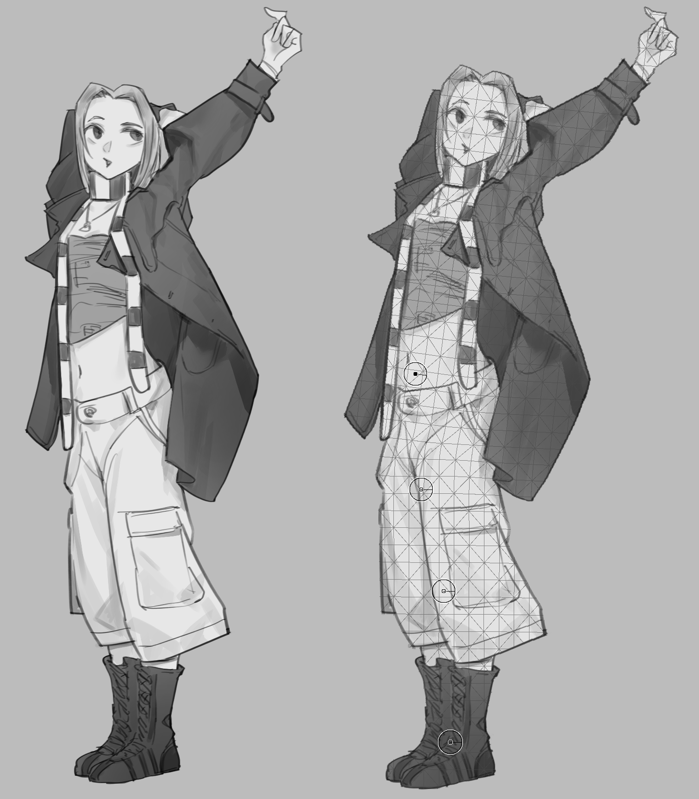

# Puppet Warp

Puppet Warp is a native mode of Krita's Transform Tool for posing characters
and reshaping raster artwork with pins that can be moved and rotated. The
artwork is covered by a triangle mesh that follows the visible artwork and
fills the interiors of closed line art.

The behavior reference is Clip Studio Paint's Puppet Warp feature:
<https://tips.clip-studio.com/en-us/articles/10496>.

## How to use it

1. Select the layer, layers, group, or selection to transform.
2. Activate the Transform Tool and choose **Puppet**.
3. While **Draw** is active, click the artwork to place pins at joints and areas
   that should stay stable.
4. Click **Lock Points** when the pins are ready.
5. Drag a pin's center to move that part of the artwork.
6. Drag the pin's outer ring to rotate the artwork around the pin.
7. Remove a pin by Alt-clicking its center. With **Click pin** set to
   **Delete pin**, a plain click on a pin removes it.
8. Apply or reset the transform with the normal Transform Tool controls.

## How the artwork bends

The mesh bends as rigidly as possible:

- **Untouched pins** hold the area around them in place.
- **A rotated pin** turns the unpinned part beyond it as one piece. For
  example, with pins at the shoulder and the elbow, rotating the elbow pin
  swings a free forearm like a joint, without twisting it.
- **The highest pin** works the same way: when it is at the hip, rotating it
  turns the upper body while lower pins keep holding the legs.
- **Adding a pin** creates a new joint and limits how far a movement reaches.
- **Separated parts** move independently: parts divided by empty space don't
  drag each other, so an arm does not pull the body next to it.

## Working with several pins

- **Select pins:**
  - Shift-click (or Ctrl-click) pins to add them to the selection or remove
    them from it.
  - Drag a rectangle on an empty part of the canvas to select the pins
    inside it; hold Shift when you start dragging to add to the selection.
  - Click an empty spot to clear the selection.
- **Move together:** drag any selected pin to move all selected pins.
- **Rotate together:** rotating the ring of a selected pin turns all
  selected pins around it.

Selected pins are drawn filled.

## Order of overlapping parts

When moved parts overlap, **Order** decides which one is drawn on top. Each
part of the artwork belongs to the pin nearest to it along the artwork. Select
the pins of a part and use the Order buttons:

| Button | Effect |
| --- | --- |
| ↑↑ | Bring to front |
| ↑ | Bring forward |
| ↓ | Send backward |
| ↓↓ | Send to back |

All pins start at the same order; among equal orders, a part of a pin placed
later is drawn on top. The order is saved with the transform and applies to
both the preview and the result. Only the artwork itself is drawn, so empty
space around a bent part never cuts into the parts behind it.

## Options

- **Show mesh** toggles the mesh overlay without changing the result. The
  overlay shows the mesh the deformation is computed on, clipped to the
  artwork.
- **Expansion** extends the detected mesh boundary from 0 to 64 image pixels.
  At 0 px, the overlay follows visible artwork closely.
- Closed line art receives a filled mesh. Gaps in a contour can prevent the
  enclosed area from being detected.
- **Click pin** sets what a click on a pin does: **Select pin** (default) or
  **Delete pin**. Alt-click always deletes. This is a tool preference and does
  not change the transform.

## Multiple layers and groups

Puppet Warp supports one layer, multiple selected layers, or a selected group.
Multiple layers are combined for the preview and mesh, but the result is
applied separately to each eligible layer. The original layer and group
structure is preserved rather than flattened.

Locked, hidden, non-editable, or unsupported node types may be skipped.

## Current limitations

- An opaque background causes the mesh to cover the layer's entire rectangular
  bounds.
- The mesh uses cells of about 24 image pixels, and its density cannot be
  changed. Limbs closer together than that can still pull on each other.
- A joint bends over a small area around its pin, so a rotated part can shift
  by a few pixels.
- **Folding a joint far** (about 90 degrees or more) pushes the artwork around
  the joint outward and can leave a gap next to it, instead of laying the
  turned part over or under its neighbour.
- Parts that touch in the artwork (for example a hand resting on the hip)
  count as connected, so rotating the elbow can also affect how the area
  near the hip moves.
- Order applies to whole parts (each part belongs to its nearest pin along
  the artwork); a part cannot be partly in front and partly behind.
- There are no per-pin strength, influence-radius, or rotation-lock options.
- Puppet transforms saved with older versions keep their original, less rigid
  deformation when reopened.
- The result is rendered on the CPU.

Agent-facing implementation, verification, and improvement notes are maintained
separately in [`agent/puppet-warp.md`](agent/puppet-warp.md).
